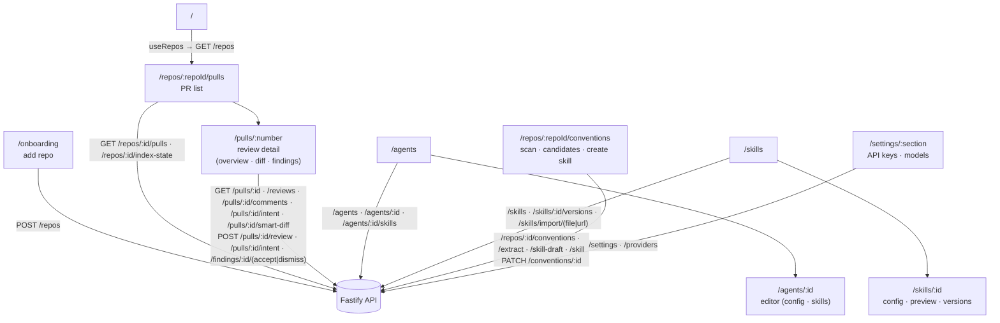

# `@devdigest/web` — the studio (Next.js 15)

The DevDigest UI: import repos, browse pull requests, run and read AI reviews,
and author agents. App Router + React Server/Client components, data via
**TanStack Query** hooks over the Fastify API. (This is the starter surface;
course lessons add the Skills, Memory, Eval, Blast/Brief, multi-agent, CI, and
dashboard screens.)

- **Stack:** Next.js 15 (App Router), React 19, TanStack Query, `next-intl`
  (messages in `messages/<locale>/*.json`), `recharts`, `mermaid`,
  `react-markdown`. UI primitives are vendored under `src/vendor/ui`
  (`@devdigest/ui`) and shared Zod contracts under `src/vendor/shared`
  (`@devdigest/shared`).
- **API base:** `NEXT_PUBLIC_API_BASE` (default `http://localhost:3001`), used by
  `src/lib/api.ts`. Every data hook lives in `src/lib/hooks/*`.
- **Run:** `pnpm dev` (`:3000`). **Test:** `pnpm test` (vitest + jsdom, fetch
  mocked — no API needed). **Typecheck:** `pnpm typecheck`.

## UI route map

Routes (`src/app/**/page.tsx`) and the API surface each leans on (via
`src/lib/hooks/*` → `src/lib/api.ts`):

The PR page (`/repos/:repoId/pulls/:number`) also shows the PR's derived intent (L03):

- **`IntentCard`** sits at the top of the **Overview** and **Agent runs** tabs, so it precedes
  the review results. It shows the summary, the in-scope and out-of-scope lists, risk areas, a
  confidence badge, the sources it was derived from (an unreadable one is marked *not read*,
  with a warning when a linked issue or document could not be read), and a re-run button. With
  no stored intent it shows **Derive intent**. Model-derived text is rendered as plain text
  nodes only.
- **`FindingCard`** shows an *Outside PR scope* badge on a finding the reviewer tagged
  `out_of_scope` (with the filter on, only a serious one survives).
- **The run trace drawer** adds a badge with the number of out-of-scope findings filtered.

The **Files changed** tab (`?tab=diff`, `DiffTab`) is the Smart Diff view (L03):

- **Groups by role.** Files sit under five headers in the order the API returns them — Core,
  Tests, Wiring, Docs, Boilerplate — each with a one-line hint and its file count; a role with no
  file has no header. Docs and Boilerplate start collapsed, with their file cards collapsed too. A
  file the grouping response does not mention is listed after the last group, so none disappears.
- **Findings inside the diff.** The tab draws the findings of the newest review of each agent: a
  dot on the file card, a coloured stripe and a severity word (`blocker`, `warning`, `suggestion`)
  on the line, the `FindingCard` under its line with Accept and Dismiss, and a **Findings outside
  the diff** block at the end of a file for a finding whose line is not in the patch. A dismissed
  finding keeps its card but stops counting. Each group header shows how many of its files have a
  counted finding.
- **One switch** — *Hide comments (N)* / *Show comments (N)*, with N the GitHub comments plus the
  counted findings of the PR's files — hides the GitHub threads and the finding cards together;
  dots, stripes and tags stay. It appears only when N is above 0.
- **Order.** **Smart order** (default) or **Original order**; the choice is `?order=original` in the
  URL (see [`docs/ui-architecture.md`](docs/ui-architecture.md) → "URL state"). If the grouping
  request fails, the tab shows the flat list with a muted line saying so. A PR with no review shows
  a muted *No review has run yet* line.
- **Fresh after a run.** The marks refresh when a run ends, on any tab, and after Accept, Dismiss
  and deleting a review or a run ([`docs/data-flow.md`](docs/data-flow.md)).

Cross-cutting chrome lives in `src/components/app-shell` (nav, breadcrumbs,
`g`-then-key shortcuts). Pages are thin; feature logic sits in colocated
`_components/<Name>/` folders, each with its own `*.test.tsx`.

## Testing

Component/interaction tests (`*.test.tsx`) run under vitest + jsdom with `fetch`
mocked, so they need neither the API nor a browser. The real browser journeys
(client + API + seeded DB) are covered by the deterministic agent-browser suite
in [`../e2e`](../e2e/README.md) and the `e2e-web.yml` workflow. See
[`../TESTING.md`](../TESTING.md).
