# `@devdigest/reviewer-core` — the review engine

Pure review logic: **diff → prompt → LLM → grounded findings**. No database,
GitHub, or filesystem; the only side effect is an LLM call through an **injected**
`LLMProvider`, which is what makes it mock-testable.

In the starter the **server** (`@devdigest/api`) is its only consumer — for local
reviews in the studio. (The CI runner that runs the same engine in GitHub Actions
is added back in the Export-to-CI lesson, L06.) The server wires it via a tsconfig
path alias (`@devdigest/reviewer-core` → `../reviewer-core/src`) and consumes the
TypeScript **source** directly (tsx in dev, vitest in tests). The package never
emits JS — its `build` is a type-check.

## Pipeline

```mermaid
flowchart LR
  IN["inputs<br/>diff · system prompt · repo map"] --> PROMPT["assemblePrompt()<br/>prompt.ts"]
  PROMPT --> WRAP["wrapUntrusted() + INJECTION_GUARD<br/>fence untrusted content vs prompt injection"]
  WRAP --> LLM["LLMProvider (injected)<br/>llm/openrouter.ts"]
  LLM --> STRUCT["structured output<br/>llm/structured.ts<br/>Zod → JSON Schema · parse-with-repair"]
  STRUCT --> GROUND["groundFindings()<br/>grounding.ts<br/>mechanical citation gate vs the diff"]
  GROUND --> SCOPE["applyScopeFilter()<br/>scope.ts<br/>only when scopeFilter is set"]
  SCOPE --> OUT["Review<br/>verdict · score · kept findings"]
```

The grounding step is the mandatory gate: a finding that doesn't cite a real line
in the diff is dropped, so the engine can't hallucinate locations. The score is
recomputed deterministically from the **surviving** findings (after grounding and
the optional scope filter), not trusted from the model. `review/run.ts`
orchestrates the run (single-pass by default).

The engine also accepts optional prompt slots the **course lessons** start
feeding it — `skills` (L02), `intent` (L03), `memory` (L07), `specs` (L05),
`callers` — plus a `reduce()`/map-reduce path and a `toReview()` CI payload helper
used from L06. A slot the caller leaves out is omitted, so `assemblePrompt`
simply leaves that section out; the order of the sections is in
[`docs/prompt-slots.md`](docs/prompt-slots.md).

## Scope filter

When the caller passes an `intent` block, the model is asked to **tag** each
finding's `scope` (`in_scope` or `out_of_scope`); it never removes anything.
Removal is `applyScopeFilter()` (`src/scope.ts`), pure code that decides from a
finding's `severity`, `category` and `kind` and the tag — no text from the PR can
reach it. It runs once, over the merged and grounded findings, and only when
`ReviewInput.scopeFilter` is `true`.

| Finding after grounding | Result |
|---|---|
| `scope` is `in_scope` or empty | kept |
| `kind` is a full-file scanner kind (`secret_leak`, `lethal_trifecta`, `phantom`, `hook`) | kept, whatever its tag |
| `out_of_scope` and **serious** — `CRITICAL`, or a `security` `WARNING` | kept as the one **signal** for that problem; serious findings in one file with overlapping lines collapse to the most severe, then most confident, and the others are filtered as `duplicate of out-of-scope signal` |
| any other `out_of_scope` | filtered, with the reason `out of scope (<SEVERITY>)` |

`ReviewOutcome.filtered` lists what was removed and why, and `ReviewOutcome.scope`
carries `{ enabled, tagged, filtered, signals }` (`null` when nothing was tagged
and the filter is off). The grounding summary string is unchanged: it counts
grounding only. Each removal is one `info` event and the totals one `result`
event, so a dropped finding is never silent. Whether the filter is on for a
given intent is the caller's call — the server turns it off for a `low`
confidence or injection-suspected intent.

## Public API

Exported from `src/index.ts`: `assemblePrompt` / `wrapUntrusted` (prompt),
`groundFindings` / `groundingSummary` (grounding), `applyScopeFilter` /
`isSeriousOutOfScope` (scope filter), `toJsonSchema` / `extractJson` /
`parseWithRepair` / `OutputTruncatedError` (structured output), plus
`reviewPullRequest` and `reduceReviews`. Contracts (`Review`, `Finding`,
`Verdict`, …) come from `@devdigest/shared`.

## Testing

`npm test` (vitest) — hermetic units with a stubbed `LLMProvider`: prompt
assembly, the grounding gate, the scope filter, `toReview` selection, and a full `run`. No keys,
no network. `npm run typecheck` doubles as the build. See
[`../TESTING.md`](../TESTING.md).
