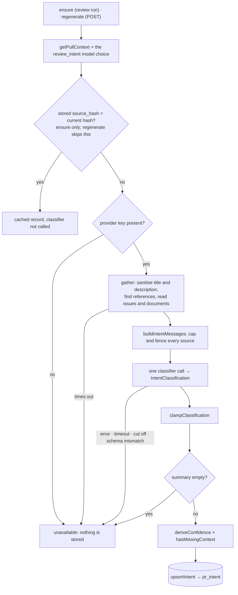

# `intent` — the PR's derived intent

`intent` derives a short statement of what a pull request sets out to do — `Intent { summary,
in_scope, out_of_scope }`, plus risk areas, a confidence tier and the sources it was built from —
with a **separate, cheap classifier model** chosen in Settings (`PR Review · Intent`, default
`openrouter` / `deepseek/deepseek-v4-flash`). It stores the result per PR in `pr_intent`, serves it
to the **Intent card**, and hands it to every review run as shared pre-work.

Two consumers use it. The card reads it through `GET` and re-derives it through `POST`; the review
run calls `container.intent.ensure` once per batch and injects the result into each agent's prompt.
The module owns the derivation; what a review run does with the result is in
[`../../../docs/architecture.md`](../../../docs/architecture.md) → "Intent in a review run", and
the filter that uses the tags is in
[`../../../../reviewer-core/README.md`](../../../../reviewer-core/README.md) → "Scope filter".

## Derivation

The provider is resolved before any GitHub call, so a missing key costs no network.

| File | Owns |
|---|---|
| [`domain.ts`](domain.ts) | The pure rules: sanitising, hunk headers, reference detection, confidence, the cache key, the classifier's output schema and its clamp. Returns values, never throws |
| [`prompt.ts`](prompt.ts) | The classifier's two messages; each source in its own `<untrusted>` block |
| [`service.ts`](service.ts) | The sequence above, the budgets, and the log lines |
| [`ports.ts`](ports.ts) · [`repository.ts`](repository.ts) | The store port and its Drizzle implementation; the repository parses the contract-shaped columns on read |
| [`routes.ts`](routes.ts) | `GET` and `POST /pulls/:id/intent` — see [`../../../README.md`](../../../README.md) → "API map" |

## What the classifier reads

Every source is untrusted text: sanitised (HTML comments and invisible characters removed),
capped, and fenced. The caps are named constants at the top of `domain.ts`.

- The title and the description (an empty description leaves the title and the changed files).
- Up to three **linked issues** of the PR's own repository, through `GitHubClient.getIssue`.
- Up to three **linked specification documents** — a repo-relative path or a `blob` link into the
  PR's own repository that ends in `.md`, `.mdx`, `.txt`, `.rst` or `.adoc` — through
  `GitHubClient.getFileContent` at the PR head SHA, then once at the base branch only when the head
  answers `not_found`. The contents API is used, never the local clone.
- The changed files: path, `+additions −deletions` and the hunk headers (the `@@` lines of
  `pr_files.patch`). **Never** an added, removed or context line, a commit message, the branch
  name, the author or an issue comment.

A reference the feature will not or cannot read is still recorded as a source with
`status: 'unavailable'` and a reason, and is listed to the model as unavailable with an
instruction not to guess its content.

| Reference in the description | Recorded as |
|---|---|
| Issue or document of this repository | read; `used`, or `unavailable` with `not_found` · `too_large` · `unsupported` (not a regular file) · `fetch_failed` · `no_token` |
| A document path that fails `normalizeRepoPath` | `spec_document`, `unavailable` / `rejected`; never requested |
| Another repository's issue or `blob` link; a Jira, Linear or Notion link; a ticket key such as `PAY-123`; a link whose text or path says spec, plan, RFC, ADR, design, proposal or PRD | `unavailable` / `unsupported` |
| Any other external `https` link that is not an image or a GitHub asset | `external_link`, `unavailable` / `unsupported`; does not count as missing context |
| A fourth or later reference of one kind | `unavailable` / `skipped` |
| A `blob` link to a **non-document** file of this repository | ignored: a link to source code is not a specification |

`missing_context` is true when at least one `linked_issue` or `spec_document` source is
`unavailable`. An `external_link` never sets it.

## Rules computed in code

- **Confidence is never the model's number.** The base tier is `high` when a linked issue or a
  specification document was read, else `medium` when the sanitised description has at least 80
  characters, else `low`. `missing_context` lowers it one tier. `injection_suspected` forces `low`.
  The model's `basis: 'insufficient'` forces `low` only when no linked issue or specification was
  read; when one was read the claim contradicts a fact and is ignored (and logged).
- **Cache key.** `sha256` over the prompt version, `provider/model`, the head SHA, the title and
  the description. `stale` is computed on read as "the stored hash differs from the current one".
  An edit to a linked issue or document alone does not change it.
- **Output is clamped**, not trusted: backticks removed; the summary, each list item and each risk
  label cut at a word boundary under their caps (`capWords`); at most six items per scope list and
  five risk areas; a risk area that only says there is no risk is dropped. An answer with an empty
  summary is not an intent and is not stored.
- **The call.** `temperature: 0`, an output budget of 2000 tokens, no reasoning pass, one repair
  retry, and an abort signal that drops the HTTP request on a timeout. An answer cut off at the
  output limit is not retried (`OutputTruncatedError`; see
  [`../../../../reviewer-core/docs/structured-output.md`](../../../../reviewer-core/docs/structured-output.md)).

## Failure

| Cause | `ensure` (review run) | `POST` |
|---|---|---|
| No API key for the classifier's provider | `unavailable` / `no_api_key` | `400` `intent_unavailable` |
| Model error, gather or call timeout, answer cut off, schema mismatch, empty summary | `unavailable` with the reason | `502` `external_service_error` |
| Unknown PR | `unavailable` / `pull_not_found` | `404` |
| A stored row whose contract-shaped columns no longer parse | treated as not derived, and replaced | same; `GET` answers `{ intent: null }` |

A read of an issue or document that fails does not fail the derivation: that reference becomes an
`unavailable` source and the confidence tier drops.

`getIssue` and `getFileContent` report their outcome at the port: a 404 is a value (`null`, or
`reason: 'not_found'`), and every other failure reaches the service as an `ExternalServiceError`.
The service maps those outcomes and never inspects an SDK error or an HTTP status.

## Logging

Every line goes through the sink the caller passes — the run's `RunLogger` in a review, `req.log`
on a route. Lines carry lengths, counts, references and reasons only: never an API key, the
title, the description, an issue or document text, a hunk header, the classifier's raw output or
the values of an unreadable row. The classifier's call and its result are two lines of their own
(`Intent classifier call →` / `Intent classifier done ←`), separate from the review's
`Review call done ←`, so the two models are told apart in the Live Log. The messages are in
[`service.ts`](service.ts); the full list is in
[`../../../specs/L03-intent-layer.md`](../../../specs/L03-intent-layer.md) → "Logging".

## Seed

`pnpm db:seed` inserts a demo intent for PR #482 in its own idempotent insert, outside the block
that seeds the PR (a change inside that block never reaches an already-seeded database). Its
`source_hash` is null, so the card renders it with no model call and a review run recomputes it.
