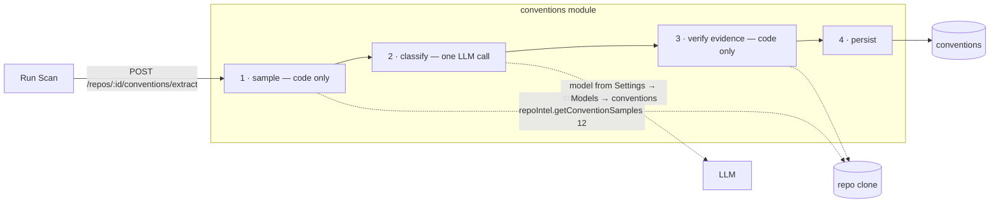

# L02 — Conventions Extractor

The extractor scans a repository for the coding conventions it actually follows and
proposes each one as a candidate rule, backed by a cited line of real code. The user
accepts, rejects or edits candidates, then turns the accepted ones into a skill
(`repo-conventions` by default) linked to an agent. From then on, reviews enforce the
project's own rules.

Sources: course lesson L02 homework, [`docs/hw2-criteria.md`](../docs/hw2-criteria.md)
(#38–53), and the design [`docs/DevDigest Design (skills).html`](../docs/DevDigest%20Design%20(skills).html)
(artboards *Conventions (N7)*, *Conventions · Create skill (merged from accepted)*,
*Conventions · empty*). What a skill is, and how it reaches the prompt, is defined in
[`L02-skills.md`](L02-skills.md).

## User stories

As a user I can: run a conventions scan on the active repo · see every candidate found ·
accept or reject each one · edit a candidate in place · open a "create skill" modal from
the ones I accepted · edit the future skill's body and metadata there · save the skill or
cancel.

## Surfaces

| Surface | Route | Criteria |
|---|---|---|
| Sidebar **SKILLS LAB → Conventions** | `/repos/:repoId/conventions` | #44 |
| **Run Scan** (empty state) / **ReScan** (header) | same | #45 |
| Candidate cards: rule, category, clickable evidence `file:start-end`, snippet, confidence %, Accept / Reject / Edit (inline) | same | #46 #47 #49 |
| Create skill button (visible once 1+ candidate is accepted) → modal | same | #41 #50 #51 |
| Settings → Models → **Conventions** row with a searchable model dropdown | `/settings/models` | #53 |

## Pipeline

1. **Sample, with no model involved (#39).** Config files that exist in the clone: ESLint,
   `tsconfig*.json`, Prettier, `.editorconfig`, Biome. Then the top 12 files from
   `repoIntel.getConventionSamples(repoId, 12)`. Each file is truncated to a fixed budget.
2. **Classify (#40).** One call to the model configured for the `conventions` feature, which
   is never hard-coded (#53). It returns `{ category, rule, evidence: { path, line,
   snippet }, confidence }[]`. The snippet may span several lines, and its location is
   stored as a range.
3. **Verify, with no model involved.** A candidate is kept only if its `path` is one of the
   sampled files and its `snippet` is found in that file near the cited `line`. The range
   is corrected to the actual match. A candidate without real evidence is dropped. The drop
   count is returned with the result.
4. **Persist (#38).** Candidates survive a reload. ReScan replaces only `pending`
   candidates. Accepted and rejected ones are kept, and a new candidate whose rule matches a
   rejected one is not re-proposed (#48).

## From candidates to a skill

"Create skill" takes the accepted candidates and drafts a skill body in code, grouped by
category. Each rule gets a `##` heading, its text, "Detected in `path:start-end`:" and the
evidence snippet in a code fence, following the design's merged body. The modal opens with
that draft: name `repo-conventions` (#42; the design's `<repo>-conventions` is the fallback
when that name is taken), description, type `convention`, Enabled, and the editable body
(#41 #51). **Create** saves the skill (source `extracted`, `evidence_files` from the
candidates) and writes v1 in one transaction. The new skill appears on `/skills` (#52).

**Linking to an agent uses the lab's mechanism** (#42): the new skill is checked on the
agent's Skills tab, just like any other skill. The modal deliberately has no agent picker,
which matches the design. After Create, a toast offers "Add to an agent →", linking to
`/agents`.

Rejected candidates never reach a draft (#48). Accepted candidates can feed several skills:
select a subset, create, select another subset, create again. This covers the "one skill or
several" acceptance line.

## Evidence links

Every candidate carries `evidence_url`, built by the server as
`https://github.com/<owner>/<name>/blob/<last_indexed_sha>/<path>#L<start>-L<end>`. It is pinned to
the indexed commit, so the link keeps pointing at the line the model cited even after the
branch moves.

## Contract surface (`@devdigest/shared`)

| Contract | Change |
|---|---|
| `ConventionCategory` | new enum |
| `ConventionStatus` | new enum: `pending` `accepted` `rejected` |
| `ConventionCandidate` | add `category`, `evidence_line_start`, `evidence_line_end`, `evidence_url`, `status`; remove `accepted` |
| `ConventionExtractResult` · `ConventionUpdate` · `ConventionSkillCreate` | new |

## Ownership

| Package | Owns | Spec |
|---|---|---|
| `server` | `conventions` module: pipeline, table change, routes, skill draft and creation | [`server/specs/L02-conventions.md`](../server/specs/L02-conventions.md) |
| `client` | the Conventions page, candidate cards, the Create skill modal | [`client/specs/L02-conventions.md`](../client/specs/L02-conventions.md) |
| `reviewer-core` | nothing. The extractor is not a review | — |

## Acceptance (cross-package)

- [ ] A scan on an indexed repo produces candidates in the UI, and every one of them has a
      clickable `file:line` that opens the real line on GitHub.
- [ ] Rejected candidates stay gone after a reload and after ReScan, and never appear in a
      created skill.
- [ ] Accepted candidates → Create skill → `repo-conventions` appears on `/skills`. Once
      checked on an agent's Skills tab, it shows up in that agent's next review trace.
- [ ] Changing the Conventions model in Settings changes the model the next scan calls.
- [ ] The PR description includes a short quality report: sampled / proposed / verified /
      accepted counts, and which rejected candidates were wrong and why.
