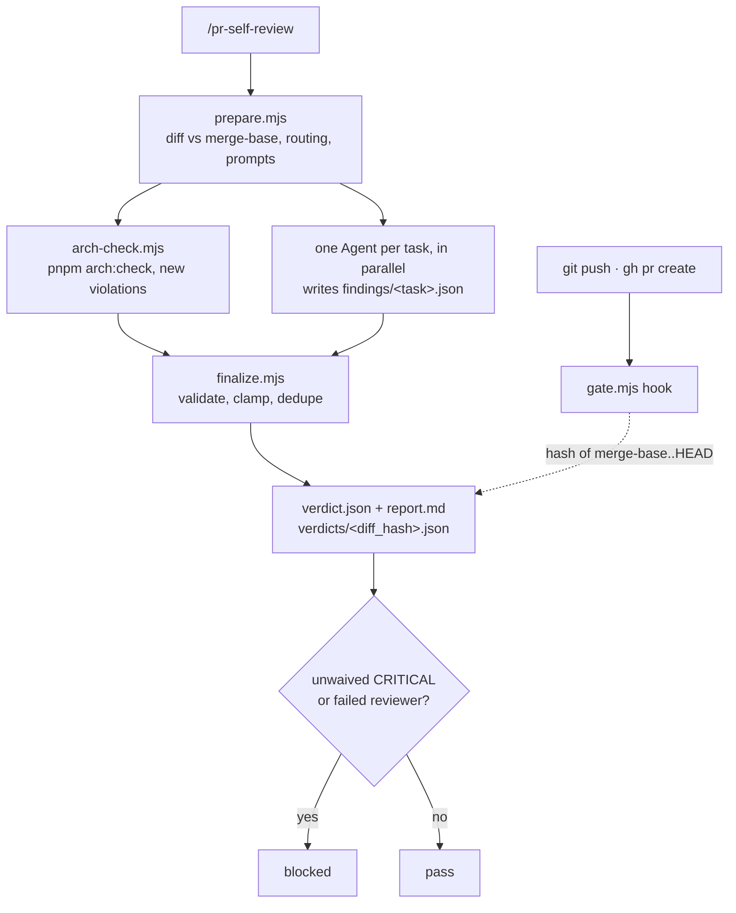

# L02 — `pr-self-review` skill

**Status:** implemented, without GitHub commit status (deferred, see the end) ·
skill: [`.claude/skills/pr-self-review/`](../.claude/skills/pr-self-review/SKILL.md)

A project skill that reviews a branch's **local changes before a pull request is opened**. It
works out which of our skills apply to which changed files, runs each one as a reviewer on its
slice of the diff, and returns one report. **One CRITICAL finding blocks the change.**

It runs in two ways:

- **manually:** `/pr-self-review` (optionally with a base: `prepare.mjs --base <ref>`);
- **before every push and every PR:** a `PreToolUse` hook denies `git push` and `gh pr create`
  unless the committed changes have a passing verdict.

Only repository tooling changes (`.claude/`, `.gitignore`, `CLAUDE.md`). No package changes, so
there are no per-module specs.

## Goals and non-goals

| Goals | Non-goals |
|---|---|
| Route every changed file to the skills that cover it: UI skills on `client/`, backend architecture skills on `server/` and `reviewer-core/` | Replacing CI tests or typecheck |
| Mix a deterministic check (`pnpm arch:check`) with LLM review | Reviewing files outside the diff |
| A strict, predictable CRITICAL bar, so the gate does not block on noise | Auto-fixing findings. The report suggests fixes; applying them is a separate step |
| Block `git push` and `gh pr create` in Claude Code | Enforcement on GitHub (deferred) · reviewing an already-open PR, which is DevDigest's own product feature |

## End-to-end flow



## 1. Collecting the diff (`lib/git.mjs`)

"All open changes" means everything that differs from the base branch: commits from
`git merge-base <base> HEAD`, plus staged, unstaged and **untracked** files. The base defaults to
`origin/main`. A branch cut from another feature branch should be reviewed with `--base` set to
that branch; the L02 branch, for example, was cut from `feature/finding-counter`.

**Always excluded** (in `routing.json`): `.devdigest/**`, lock files, `server/src/db/migrations/**`,
`client/src/vendor/**`, `*.md`, and binaries and images.

**`diff_hash`** is a SHA-256 over `path → blob id` of every reviewable changed file. It hashes
content, not commits. So reviewing uncommitted work and then committing exactly that work gives
the same hash, and any other edit gives a new one.

## 2. Routing (`routing.json` + `lib/routing.mjs`)

Skill descriptions are written for triggering, not routing. Most skills are also vendored through
`skills-lock.json`, so editing their `SKILL.md` is out. Routing is therefore an **explicit
manifest**: each skill gets include and exclude globs, `can_block`, `critical_rules`, and a
`model`. Every folder in `.claude/skills/` is discovered from its frontmatter. A skill missing
from the manifest is reported as **unrouted**, so a new skill cannot silently drop out of review.

| Skill | Files | Blocks? | Model |
|---|---|---|---|
| `onion-architecture` | `server/src/**`, `reviewer-core/src/**` (no tests) | yes | opus |
| `frontend-ui-architecture` | `client/src/**/*.{ts,tsx}` (no tests) | yes | opus |
| `react-best-practices` | `client/src/**/*.tsx`, `use-*.ts` | yes, 3 rules | opus |
| `security` | all three `src/` trees (no tests, no mocks) | yes, 6 rules | opus |
| `next-best-practices` | `client/src/app/**` | no | sonnet |
| `fastify-best-practices` | routes, `_shared`, `platform`, `app.ts` | no | sonnet |
| `drizzle-orm-patterns` | repositories, `server/src/db/**` | no | sonnet |
| `postgresql-table-design` | `server/src/db/schema*` | no | sonnet |
| `zod` | `server/src/vendor/shared/**` | no | sonnet |
| `react-testing-library` | `client/src/**/*.test.*` | no | sonnet |
| `typescript-expert`, `mermaid-diagram`, `engineering-insights`, `pr-self-review` | — | `review: false` | — |

A skill's files are split into batches of `max_files` (12), one task per batch. `arch-check`
runs when the diff touches `server/src/**`, `reviewer-core/src/**` or the dependency-cruiser
config.

## 3. Reviewing

- **Deterministic:** `arch-check.mjs` runs `pnpm arch:check --output-type json` and keeps the
  violations that are not in the baseline. One that starts in a changed file is CRITICAL
  (`dep-cruiser/<rule>`); one elsewhere is WARNING.
- **LLM:** `prepare.mjs` writes a filled prompt per task (`prompts/<task>.md`, from
  `references/reviewer-prompt.md`) and a patch with only that task's files. The orchestrator
  launches one `general-purpose` subagent per task, all in one message, with the task's model.
  Each subagent reads only its own skill and writes `findings/<task>.json`.

## 4. Validation and the CRITICAL bar (`lib/verdict.mjs`)

| Check | Outcome |
|---|---|
| file missing, invalid JSON, a field of the wrong shape, a file outside the task | the task **fails**; re-run once, and if it fails again the verdict is `blocked: incomplete` |
| `evidence` is not a quote from the task's patch | the finding is dropped |
| `line` is not on a changed line (±2) | SUGGESTION, labelled `pre-existing` |
| CRITICAL whose `rule_id` is not in the skill's `critical_rules` (empty when `can_block: false`) | WARNING, labelled `clamped` |
| same `rule_id` + file + line from two tasks | merged, the higher severity wins |

The list of rules that may stay CRITICAL is
[`references/critical-rules.md`](../.claude/skills/pr-self-review/references/critical-rules.md),
and it is the only place the bar can change.

## 5. Verdict, waivers, gate

- `finalize.mjs` writes `verdict.json` and `report.md` into the run, and copies the verdict to
  `.devdigest/self-review/verdicts/<diff_hash>.json` (gitignored).
- **Waivers:** only when the user explicitly asks, with a reason, run
  `waive.mjs <F-id> --reason "…"`. The waiver lives in that run's `waivers.json`. It is refused
  if the files have changed since the review. Any change produces a new hash, so the old verdict
  no longer matches, and the next review starts with no waivers.
- **Gate:** `gate.mjs` reads the hook input and acts only on `git push` and `gh pr create`,
  detected by `lib/command.mjs`, which reads the line as a shell would: quoted text and heredoc
  bodies are data, `&&` `;` `|` and subshells start new commands, and env assignments and git's
  global options (`git -C dir push`) are skipped. So `echo "git push"` passes, and
  `cd x && git push` does not. Commands assembled at runtime (`eval`) are out of reach. It
  hashes merge-base..HEAD against the base of the latest review run, which is what the push or PR
  would contain, then looks up the verdict for that hash:
  - none → deny, "run `/pr-self-review`";
  - `blocked` → deny, listing the open CRITICALs;
  - `pass` → allow.

  Exit 2 is how it denies. If the committed diff is empty, the PR would be empty, so the gate
  allows it.

## The git pre-push hook

The Claude Code hook only sees pushes that Claude runs. `.githooks/pre-push` covers the rest:
git calls it on every `git push` with one line per ref (`<local ref> <local sha> <remote ref>
<remote sha>`), and `scripts/pre-push.mjs` runs the same `checkPublish` as the gate for each pushed
commit, which need not be the checked-out one. Deletions and tags pass. Git never runs a
repository's hooks on its own, so each clone opts in with `git config core.hooksPath .githooks`,
which `./scripts/dev.sh` does. `git push --no-verify` skips it; it guards against forgetting, not
against a deliberate bypass.

## Registering the hook

The hook is registered in the committed `.claude/settings.json` (2026-09-27). In auto mode, writing
it may be refused as self-modification (see the root `INSIGHTS.md`); the snippet is:

```json
{
  "hooks": {
    "PreToolUse": [
      {
        "matcher": "Bash",
        "hooks": [
          { "type": "command", "command": "node \"$CLAUDE_PROJECT_DIR\"/.claude/skills/pr-self-review/scripts/gate.mjs" }
        ]
      }
    ]
  }
}
```

## Tests

`node --test '.claude/skills/pr-self-review/scripts/test/*.test.mjs'`: 64 tests, no dependencies.
They cover routing (client-only, server-only, tests, batching, unrouted skills, dot-folders); the
verdict rules (clamp, pre-existing, dropped evidence, incomplete, arch-check, dedup, waiver); which
command lines the gate treats as a push or PR (`command.test.mjs`); the pre-push hook, down to a
real `git push` against a bare remote (`pre-push.test.mjs`); the
hash (commit keeps it, edit changes it); and the full cycle on a throwaway repo (block → gate
denies → waive → gate allows → edit → gate denies, waive refused). Behavioural evals are in
`evals/evals.json`.

## Acceptance criteria

- [x] A diff only in `client/` runs only the UI skills and does not run `arch:check`.
- [x] A diff only in `server/` runs `onion-architecture` + `arch:check` and does not run the UI skills.
- [x] A new `arch:check` violation in a changed file → `blocked`, whatever the LLM says.
- [x] A CRITICAL from a skill with `can_block: false` is shown as WARNING.
- [x] A finding outside the changed lines never blocks.
- [x] `git push` and `gh pr create` without a review of the committed changes are denied by the hook; after a `pass` they go through.
- [x] A new skill in `.claude/skills/` without a manifest entry shows up as a warning.
- [x] A waived CRITICAL turns the verdict into `pass`; any later change makes it stale, and the waiver is gone.
- [x] The hook is registered in `.claude/settings.json`.

## Decisions

| # | Question | Decision |
|---|---|---|
| 1 | Which skills can block? | The two architecture skills, `security`, and a narrow slice of `react-best-practices`. `next-best-practices` stays advisory. |
| 2 | Can a CRITICAL be waived? | Yes, by hand, with a reason, stored in the run only. Any change resets it. To be refined when the skill is polished. |
| 3 | Hook on `git push` too? | Yes (2026-09-27): a push publishes unreviewed code just as a PR does, so both are gated. |
| 4 | CI backstop? | Not yet. A local git pre-push hook covers pushes from outside Claude Code (2026-09-27). |
| 5 | Models | Opus for the blocking skills, Sonnet for the advisory ones. |
| 6 | GitHub commit status + branch protection | Deferred (below). |

## Deferred: enforcement on GitHub

The hook only covers PRs opened from Claude Code. To block the merge button too:

1. `finalize.mjs` would post a commit status to the pushed `HEAD`:
   `POST /repos/yrazub/dev-digest/statuses/<sha>`, with context `devdigest/pr-self-review` and
   state `success` or `failure`. It would post only when the tree is clean and `HEAD` is pushed.
   It needs `gh` (not installed yet) or a fine-grained PAT with *Commit statuses: write*.
2. Branch protection (or a ruleset) on `main` would require a PR and the status check
   `devdigest/pr-self-review`. The check has to be posted once before the UI offers it. Because
   the repository is public, this is free.

The known hole is that a status posted from a local machine can be forged. A CI job that re-runs
at least `arch:check` would close it.
