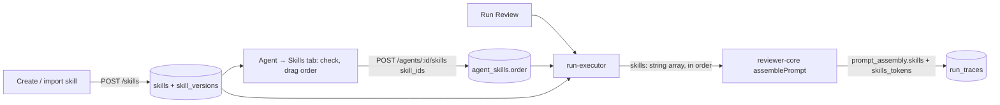

# L02 — Skills in the product

Skills become first-class records. A skill is a markdown body of review rules, with a name,
a type and a directive description, stored in the product database. It is authored or
imported once, linked to any number of agents in a chosen order, and injected into the
agent's prompt at run time. A reviewer without skills checks a diff formally. With skills,
it checks the rules the team agreed on. Every skill costs tokens on every run, so the
product shows what it costs and what it changed.

Two reviewer agents prove the point with a before/after experiment: without their skills
they miss a class of bug, with them they catch it.

## Sources

- Lesson L02 **Hands-On Lab (video 2)**: product requirements for Skills
  (`edu.goit.global/…/53167992/training?blockId=53196996`).
- Lesson L02 **homework**: Conventions Extractor plus an own reviewer agent with skills
  (`…/53167992/homework`).
- Checklist [`docs/hw2-criteria.md`](../docs/hw2-criteria.md). Numbers like `#9` below refer to it.
- Design [`docs/DevDigest Design (skills).html`](../docs/DevDigest%20Design%20(skills).html),
  artboards *Agents · empty state*, *Agent Editor · Config / Skills*, *Skill Editor ·
  Config / Preview / Versions*, *Run Trace · completed*.

The Conventions Extractor produces a skill and is specified separately in
[`L02-conventions.md`](L02-conventions.md).

**Out of scope** (lab): internet search for skills (the design's *Community search
drawer*), memory of accept/dismiss, running agents in parallel, storing a skill's file
tree. Also out of scope: the design's *Evals*, *Stats* and *CI* tabs and the
runs/accept/cost figures on cards, which belong to later lessons. Handled separately: the
`AGENTS.md` rename (#1–2) and turning off the `pr-self-review` push hook (#21). The
`.claude/skills` criteria (#3–5) are already met.

## Surfaces

Both SKILLS LAB screens use the design's **list + detail** layout: a searchable list column
on the left and the selected item's editor on the right. The URL carries the selection, so
the detail pane is a side panel (#10) and also a page with its own route (#25 #35).

| Surface | Route | Criteria |
|---|---|---|
| Sidebar: **SKILLS LAB** section with Skills, Agents, Conventions. WORKSPACE keeps Pull Requests | — | #6 #44 |
| Skills list column: card grid or list, search, **Add Skill** (Create / Import), delete on each card | `/skills` | #9 #11 #12 #15 #22–24 |
| Skill detail pane: tabs **Config · Preview · Versions** | `/skills/:id` | #10 #25–29 |
| Agents list column: tiles, search, **Add Agent**, delete on each tile | `/agents` | #7 #32–34 |
| Agent detail pane: tabs **Config · Skills**, nothing else | `/agents/:id` | #13 #30 #31 #35–37 |
| Run trace: "Skills loaded" in Configuration, and a **Skills** block with its own token count in Prompt assembly | PR → Agent runs → trace | #19 #20 |

## End-to-end flow

At run time, the executor loads the agent's linked skills where `skills.enabled = true`,
ordered by `agent_skills.order`. It renders each one as its own headed block and passes the
array to `reviewPullRequest({ skills })`. **Order on the Skills tab is order in the prompt
(#14).** The same list goes through in the same order, and nothing re-sorts it. The system
prompt comes first and the skills follow it, as the design's hint puts it: "Skills are
appended below it". A skill that is unlinked, or globally disabled, contributes nothing: no
block, no header, no log line (#20).

## Rules that span packages

- **Two switches, both must be on.** `skills.enabled` is the global switch, the toggle on
  the skill card and in the skill's Config (#9). The link in `agent_skills` is the
  per-agent switch, the checkbox on the agent's Skills tab (#37). A skill reaches the prompt
  only when it is both enabled and linked.
- **The description is the skill's interface.** It is phrased as a directive ("Flag … when
  …"), and the form says so under the field.
- **Versioning snapshots the body.** Creating a skill writes v1. A save that changes `body`
  bumps `skills.version` and appends a `skill_versions` row with an optional one-line change
  note. Metadata edits (name, description, type, enabled) do not create a version. Restore
  (#29) copies an old body forward as a *new* version, so history is never rewritten.
- **Provenance is kept.** `source` records how a skill arrived: `manual`, `imported_file`
  (.md or .zip, new value), `imported_url`, or `extracted` (from Conventions). Cards show it
  as *Manual*, *Imported* or *Extracted*, and #16 relies on it.
- **An imported skill is untrusted input.** Someone else's skill is someone else's
  instructions in our agent's prompt. Import always goes through a mandatory preview, and
  nothing is stored until the user confirms (#15). From an archive, only the `SKILL.md`
  core is kept. Scripts and other files are listed in the preview as *ignored*, and are never
  executed, stored or sent to a model.

## Contract surface (`@devdigest/shared`)

| Contract | Change |
|---|---|
| `SkillSource` | add `imported_file` |
| `Skill` | add `agent_count`, `created_at` |
| `SkillCreate` · `SkillUpdate` · `SkillVersion` · `SkillImportDraft` | new |
| `Agent` | add `skill_count` |
| `AgentSkill` | new: `Skill` plus `linked` and `order`, for the agent's Skills tab |
| `PromptAssembly` | add `skills_tokens`, `skills_loaded` |

Detail and the one migration (`skill_versions.note`):
[`server/specs/L02-skills.md`](../server/specs/L02-skills.md).

## Seeded and authored content

| What | Where | How it enters the product |
|---|---|---|
| **Test Quality Reviewer** agent: uncovered branches, missed corner cases, excessive mocking, flaky tests | `docs/agent-prompts/test-quality-reviewer.md` → `server/src/db/seed-prompts.ts` | seeded (idempotent), fourth agent next to General, Security and Performance |
| Test-quality skills `branch-coverage`, `edge-cases` | `docs/skills/test-quality/<name>/SKILL.md` | one imported as `.zip`, one created in the modal |
| **API Contract Reviewer** agent | `docs/agent-prompts/api-contract-reviewer.md` | created through the UI (Add Agent) |
| API contract skills `breaking-change`, `response-schema`, `semver-discipline`, `deprecation-policy` | `docs/skills/api-contract/<name>/SKILL.md` | at least one imported as `.zip`, one as `.md`, one by URL; the rest created in the modal |

Every skill file has frontmatter (`name`, `description`, `type`), a directive description,
and a **Good / Bad** example pair (#43). The agents' own prompts must *not* already contain
their skills' rules. Otherwise the control experiment has nothing to show.

## Control experiments (#17 #18)

Both use throwaway PRs opened against `yrazub/dev-digest` itself. They are never merged, and
are closed after the demo recording.

| PR | Branch | Diff | Agent |
|---|---|---|---|
| Happy-path test | `experiment/happy-path-test` | adds a small pure helper with 3+ branches and an edge case (empty input, boundary value), plus one test that covers only the success path | Test Quality Reviewer |
| Breaking API change | `experiment/api-breaking-change` | renames a field in an existing route's response and changes a route param, with no deprecation or version bump | API Contract Reviewer |

Protocol for each PR:
1. Uncheck the agent's skills, run the review twice, and record the findings. Expect the
   bug to be missed.
2. Check the skills, run twice again, and record. Expect the uncovered branch and edge case
   (#17), or the breaking change (#18), to be flagged.
3. Swap two skills' order and run again. The trace's Skills block shows them swapped (#14).

Running twice accounts for LLM nondeterminism. The PR description reports every run.

## Ownership

| Package | Owns | Spec |
|---|---|---|
| `server` | `skills` module (CRUD, versions, import), agent ↔ skill reads, skill injection in `run-executor`, `skills_tokens`, seed | [`server/specs/L02-skills.md`](../server/specs/L02-skills.md) |
| `client` | SKILLS LAB nav, the Skills and Agents list+detail screens, the agent Skills tab, the trace additions | [`client/specs/L02-skills.md`](../client/specs/L02-skills.md) |
| `reviewer-core` | no code change. The `skills` slot already exists and joins blocks in the order it receives them ([`docs/prompt-slots.md`](../reviewer-core/docs/prompt-slots.md)) | — |
| `e2e` | one flow: create skill → check it on an agent → reorder → run → the trace shows the Skills block | `e2e/specs/08-skills.flow.json` |

## Resolved

- **Sidebar ownership (2026-09-28).** The menu is app-owned: `APP_NAV` in
  `client/src/components/app-shell/nav.ts`, injected into the vendored `Sidebar` through
  `ShellContext.nav`. The SKILLS LAB section (#6 #44) is added there, with no vendor edit.
  See the Decisions entry in `client/INSIGHTS.md`.

## Acceptance (cross-package)

- [ ] A skill created through `POST /skills` is a row in `skills` and `skill_versions`. A
      row deleted directly in SQL disappears from `GET /skills` (#8).
- [ ] Reordering skills on the agent's Skills tab changes the order of their blocks in the
      next run's trace (#14).
- [ ] An enabled and linked skill appears in the trace under "Skills loaded" and as its own
      block, with a token count for the whole Skills block. A disabled or unlinked skill
      leaves no trace (#19 #20).
- [ ] An imported archive with a script in it: the preview lists the script as ignored, and
      nothing but the `SKILL.md` body is stored.
- [ ] Both control experiments reproduce: missed without skills, caught with skills
      (#17 #18).
- [ ] At least one skill checked on each new agent has source `imported_file` or
      `imported_url` (#16).
