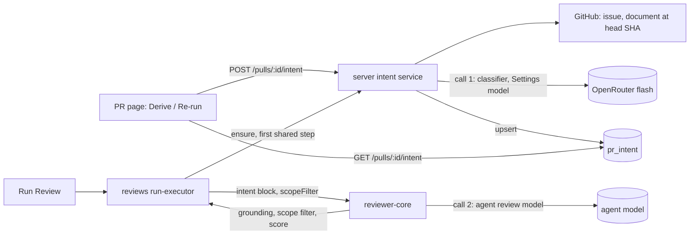

# L03 — Intent layer

A pull request gets a derived **intent**: one sentence of what it changes and why, what is in
scope, what is out of scope, and the risk areas that follow from the changed paths. A separate
cheap flash-class model, called through OpenRouter and chosen in Settings, derives it from the
PR's title, description, linked ticket, linked plan or specification, and the changed files
with their hunk headers (never change bodies). The intent is stored per PR, can be re-run by
the user, is shown on the PR page before the review results, and is injected into every review
prompt. There, comments outside the PR's scope are filtered, and a serious out-of-scope
problem is kept as one signal.

This spec states the feature and the rules that span packages. The implementable detail is in
the module specs (see Ownership). The approved plan is
[`L03-intent-layer-plan.md`](L03-intent-layer-plan.md).

## Sources

- Lesson L03 requirements R1–R9 (below). Numbers `R1`…`R9` refer to them.
- Plan [`L03-intent-layer-plan.md`](L03-intent-layer-plan.md), Design section; open questions
  1–13 settled by the user as recommended.

## Requirements

| Req | Statement |
|---|---|
| R1 | A separate cheap call returns `Intent { summary, in_scope[], out_of_scope[] }`. Inputs are the title, description, ticket, plan/spec and the files with hunk headers; no change bodies |
| R2 | The intent is stored per PR; the user re-runs it when the PR updates |
| R3 | The structured intent enters the reviewer prompt; out-of-scope comments are filtered; a serious out-of-scope problem leaves one signal |
| R4 | The intent card sits before the review results so the user can check the understanding |
| R5 | The classifier's model is a separate Settings choice |
| R6 | The log shows prompt components, model, token estimate and sources; no secrets, no unnecessary diff content |
| R7 | An empty description falls back to the title, file names and hunk headers |
| R8 | A ticket, plan or specification is fetched; an unavailable link is marked, never invented |
| R9 | The two model calls (classifier, review) are separate in the logs |

**Out of scope:** Smart Diff, the Blast Radius card (L04), the verdict card and the "PR Brief"
grouping on Overview (L05); commit messages, the branch name and the author as input; any patch
body in the classifier input; fetching external URLs, trackers other than a GitHub issue of the
PR's own repository, cross-repository references and issue comments (detected and recorded as
unavailable, not read); editing an intent by hand; computing it on PR sync or on page open;
adding the intent's cost to `agent_runs` or the PR-list total.

## Input sources

Every source is untrusted text: sanitised, capped and fenced before it reaches the classifier.

| # | Source | Read from | Cap |
|---|---|---|---|
| 1 | Title | `pull_requests.title` | 300 chars |
| 2 | Description | `pull_requests.body` | 4000 chars |
| 3 | Linked ticket | a GitHub issue of the PR's own repository, found by references in the description | 3 fetched; title 300 + body 3000 chars each |
| 4 | Plan or specification | a repo-relative `.md .mdx .txt .rst .adoc` path, or a `blob` URL of the PR's own repository whose path ends in one of those extensions, read through the GitHub contents API at the PR head SHA; read once at the base branch only when the document is not found at the head | 3 fetched; 200 KB read, 8000 chars used each |
| 5 | Changed files | `pr_files`: path, additions/deletions, and the `@@` hunk-header lines of the patch | 60 files; 8 headers per file; 160 chars per header; 4000 chars in total |

Never sent to the classifier: added, removed or context lines of a patch; commit messages; the
branch name; the author; issue comments. An empty description leaves rows 1 and 5 only, and
confidence is `low` (R7).

## End-to-end flow

`GET` never computes. `POST` always recomputes: it is the card's **Derive intent** button
before a first derivation and **Re-run** afterwards. A review run calls `ensure` as its first
shared step, so a user who never pressed Derive still gets an intent in the prompt. A failure
inside a review run is non-fatal: no row is written, the intent slot is omitted, no scope
filter runs, and the agents run as today.

## Rules that span packages

- **Cache key and staleness.** `source_hash = sha256(prompt version, provider/model, head SHA,
  title, body)`. `stale` is true on read when the stored hash differs from the current one. A
  review run recomputes when no row exists, when the stored hash is null (the seeded row) or when
  it differs. An edit to a linked issue or document alone does not change the hash; Re-run
  covers it.
- **Model resolution (R5).** Provider and model come from `settings.feature_models.review_intent`,
  else the `FEATURE_MODELS` default (`openrouter` / `deepseek/deepseek-v4-flash`). Nothing reads
  `agents.model` or `agents.provider` for the classifier.
- **Confidence is computed in code**, never taken from the model. Base tier from the sources
  that were read: `high` when a linked issue or a spec document was read; else `medium` when
  the description has at least 80 characters after sanitising; else `low`. `missing_context`
  lowers it by one tier; `injection_suspected: true` forces `low`. `basis: 'insufficient'` forces `low` only when no linked issue or specification was read; when one was read the claim contradicts a fact, is not applied, and is logged.
- **Missing context (R8).** Every reference found in the description is recorded as a source,
  read or not, with a reason (`not_found`, `fetch_failed`, `no_token`, `too_large`, `rejected`,
  `unsupported`, `skipped`). A missing issue or document gives `not_found` (a document file with
  no content too); an oversized document `too_large`; a path that is not a regular file
  (directory, symlink, submodule) `unsupported`; any other GitHub failure (auth, rate limit,
  transport, timeout) `fetch_failed`; no GitHub token `no_token`. `missing_context` is true when
  at least one `linked_issue` or `spec_document` source is `unavailable`. An `external_link` is
  recorded and shown but does not set it. A link to a source file of the PR's own repository is
  not a reference: it is not recorded and sets nothing. The classifier is told not to guess what
  an unavailable source says.
- **Stored intent is parsed on read.** The contract-shaped `pr_intent` columns (`in_scope`,
  `out_of_scope`, `risk_areas`, `sources`, `confidence`) are parsed once, when the row is read.
  An unreadable row reads as not derived: `GET` answers `{ intent: null }`, one log line names
  the failed columns (never the stored values), and the next derivation replaces the row.
- **Trust.** The classifier fences every source as `<untrusted>` data. HTML comments and
  invisible or bidirectional Unicode are stripped before capping. The model-derived intent
  reaches the reviewer as data with provenance (`<untrusted source="pr-intent">`), never as
  instructions. Model-derived text is rendered in the client as React text nodes only.
- **The model tags; code filters.** The reviewer model sets `Finding.scope` (`in_scope` /
  `out_of_scope`), and is told to report every finding as it would without the block. The
  deterministic scope filter lives in `reviewer-core`, after grounding and before scoring:
  - `in_scope` or untagged findings are kept;
  - scanner kinds (`secret_leak`, `lethal_trifecta`, `phantom`, `hook`) are kept whatever the tag;
  - an out-of-scope **serious** finding (`CRITICAL`, or `security` at `WARNING`) is kept as the
    signal, once per distinct problem (same file, overlapping lines: the most severe, then most
    confident; the others are filtered as duplicates);
  - any other out-of-scope finding is filtered with a reason.
- **When the filter runs.** Only when the server passes `scopeFilter: true`, i.e. the intent is
  not `low` confidence and not injection-suspected. Otherwise the block is still injected and
  findings are still tagged, but nothing is removed. With no intent there is no tagging and no
  filter.
- **Score and counts** are computed from the kept findings, so a signal counts like any finding
  of its severity and still blocks. The grounding string stays a grounding-only count.
- **Two calls, two logs (R6, R9).** The classifier pair and the review call each name their own
  provider/model and token counts. The persisted trace starts `tool_calls` with a
  `classify_intent` entry. Logs carry lengths, counts, references and reasons only: never keys,
  the title, description, issue or document text, hunk headers, diff content or the classifier's
  raw output.

## Contract surface (`@devdigest/shared`)

| Contract | Change |
|---|---|
| `Intent` | field `intent` renamed to `summary`; `in_scope`, `out_of_scope` unchanged |
| `IntentRiskKind` · `IntentRiskArea` · `IntentConfidence` | new |
| `IntentSourceKind` · `IntentSourceStatus` · `IntentSourceReason` · `IntentSource` | new |
| `PrIntentRecord` | extended: `risk_areas`, `confidence`, `sources`, `missing_context`, `injection_suspected`, `stale`, `model`, `cost_usd`, `computed_at` |
| `PrIntentResponse` | new: `{ intent: PrIntentRecord \| null }` |
| `FindingScope` · `Finding.scope` | new, `scope` nullish |
| `PromptAssembly.intent` | new, nullish |
| `RunStats.scope_filtered` | new, nullish; null when the filter did not run |
| `FEATURE_MODELS` · `review_intent` | default becomes `openrouter` / `deepseek/deepseek-v4-flash` |
| `GitHubClient` | `getFileContent` · `RepoFile` · `RepoFileResult` · `RepoFileMissReason` are new; `getIssue` returns `IssueMeta \| null` (server-only ports, not copied to the client) |

The `pr_intent.intent` column keeps its name and holds `Intent.summary`; the repository maps it.
`PrBrief` keeps `intent: Intent`. The client's copy of the contracts is synced separately,
changed lines only.

## Ownership

| Package | Owns | Spec |
|---|---|---|
| `@devdigest/shared` (authored in `server/`) | the contract changes above | this file |
| `server` | new `intent` module (repository, service, routes), the `pr_intent` and `findings.scope` columns (one migration), `GitHubClient.getFileContent`, intent as shared pre-work in the review run, the demo seed for PR #482 | `server/specs/L03-intent-layer.md` |
| `reviewer-core` | the `intent` prompt slot with its trusted note, the scope filter, `ReviewInput.intent` / `scopeFilter`, `ReviewOutcome.filtered` / `scope` | `reviewer-core/specs/L03-intent-scope.md` |
| `client` | the `IntentCard` on Overview and Agent runs, the intent hook, the `Outside PR scope` badge, the filtered count in the trace drawer, the Settings default | `client/specs/L03-intent-layer.md` |
| `e2e` | one flow on seeded data with no model call | `e2e/specs/09-pr-intent.flow.json` |

## Resolved

Open questions 1–13 of the plan were settled by the user as recommended on 2026-10-04: the
intent is stored per PR and derived by a button or by a review run, not on page open; the
contract field is `summary` and the column stays `intent`; `risk_areas` stay as an extension;
no arbitrary URL is fetched; re-run only, no hand edit; three deterministic confidence tiers;
the intent repository reads the Settings model itself; the linked document does not go to the
reviewer verbatim; `pr_intent` moves to the `intent` module; serious means `CRITICAL` or
`security` at `WARNING`; the filter runs only for a `high` or `medium` intent that is not
injection-suspected; unreadable tickets and specs count as missing context, other links do not;
the card is on both Overview and Agent runs; a demo intent is seeded for PR #482.

Decisions of 2026-10-05, after the architecture review and the plan verification: a stored
intent row that fails its read parse is treated as absent, logged by column name and replaced
by the next derivation; `getIssue` and `getFileContent` report their outcome at the port (`null`
or a miss reason, anything else an `ExternalServiceError`), so the service no longer inspects
SDK errors and `too_large` is produced; the base branch is read only after a `not_found` at the
head; a link to a source file of the PR's own repository is not a reference.

Decisions of 2026-10-05, after the second review (plan revision 4): the classifier's risk-area
item is taken from the contract's `IntentRiskArea`; the scans of author text in `sanitizeText`
and `extractReferences` are linear, with what they detect unchanged; tests that read a run
trace wait for it, and the executor still marks a run `done` before it writes the trace.

Decisions of 2026-10-06, after the feature ran against the real classifier (plan revision 5):
the classifier's output budget is 2000 tokens and it is called without the model's reasoning
pass; the call carries an abort signal, so a timeout drops the request; an answer cut off at
the output limit is not retried (`output_truncated`) and an answer with an empty summary is
not stored; output text is plain and cut at a word boundary, and a risk area that only says
there is no risk is dropped; `basis: 'insufficient'` lowers the tier only when no linked issue
or specification was read. Left open: OpenRouter's choice of upstream provider, which moves
the same call between 2 and 30 seconds.

## Acceptance (cross-package)

- [ ] `POST /pulls/:id/intent` stores an intent and `GET` returns it; `GET` on a PR with none
      returns `{ intent: null }` and never calls a model (R1, R2).
- [ ] The classifier call uses the Settings model for `review_intent`, not the agent's model
      (R5), and its input holds no patch line other than `@@` headers (R1).
- [ ] A PR with an empty description derives from title, files and hunk headers with `low`
      confidence (R7).
- [ ] A reference that cannot be read is listed on the card as `not read`, sets
      `missing_context`, lowers the tier and is never described by the model (R8).
- [ ] The card is on the PR page before any review has run, above the results (R4).
- [ ] The review prompt carries the `## PR intent (derived)` block after the PR description when
      an intent exists, and no heading when it does not (R3).
- [ ] With the filter on, an out-of-scope `SUGGESTION` is removed and an out-of-scope `CRITICAL`
      stays once, badged `Outside PR scope`; every drop is logged and counted in the trace (R3).
- [ ] The Live Log and the persisted trace distinguish the classifier call from the review call,
      each with its model and tokens, and contain no secret or source text (R6, R9).
- [ ] A failed classification leaves the review run `done`, without an intent block.
- [ ] A stored intent row that fails its read parse answers `{ intent: null }` and never a 5xx.
