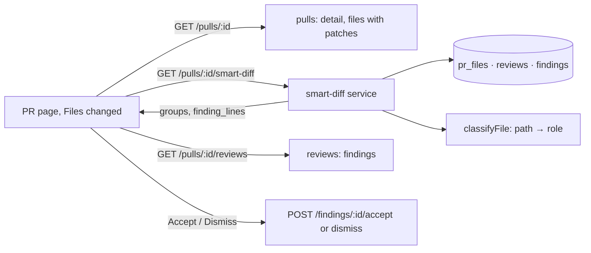

# L03 — Smart Diff

The **Files changed** tab of a pull request stops listing files in the order GitHub returned
them. It groups them by the role each file plays in the change, in a fixed reading order
`core → tests → wiring → docs → boilerplate`, and it shows the result of the latest review
inside the diff: a counter on the group header, a dot on the file card and the finding itself
under the line it is about. A switch returns the original order.

Grouping is a deterministic rule over file paths. It makes no model call and works before the
first review.

This spec states the feature and the rules that span packages. The implementable detail is in
the module specs (see Ownership). There is no plan yet: the `planner` agent writes it from this
spec, and it is saved as `L03-smart-diff-plan.md` once approved.

## Sources

- Course task "Домашнє завдання: Smart Diff" (L03), read on 2026-10-06, including its four
  prototype screenshots. The criteria below keep the task's priorities: `A` is P1 (blocks
  acceptance), `B` is P2, `C` is P3.
- The current code on `main` at `a9616d3`. Per the project rule, the feature is designed from
  the current code and the prototype, not from the repository history.

## Requirements

| Req | Priority | Statement |
|---|---|---|
| A1 | P1 | Files changed shows the groups in the order core → tests → wiring → docs → boilerplate, each with its role label and its number of files |
| A2 | P1 | A lock file is classified as boilerplate; docs and boilerplate start collapsed |
| A3 | P1 | After a review, a group header shows how many of its files have findings |
| A4 | P1 | The card of a file with findings shows a dot |
| A5 | P1 | In an expanded file, the finding is shown under its line: severity, title, rationale |
| A6 | P1 | An **Original order** switch returns the order GitHub gave |
| A7 | P1 | A pull request in the fork with a description of the implementation and a 1–3 minute demo video |
| B1 | P2 | Patterns and role order are in one constants file; a unit test covers a "path → role" table, including the three disputed cases |
| B2 | P2 | `GET /pulls/:id/smart-diff` answers with a body that parses as `SmartDiff`; the role enum is extended in both copies of `brief.ts` |
| B3 | P2 | Viewing Smart Diff makes no model call; grouping works before the first review |
| B4 | P2 | The line with a finding has a coloured stripe on the left and a severity tag on the right |
| B5 | P2 | Accept and Dismiss in the inline finding work and change the finding's state |
| B6 | P2 | A finding whose line is not in the patch is shown in a separate block at the end of the file, never dropped |
| B7 | P2 | Inline findings are hidden by the same switch that hides GitHub comments |
| B8 | P2 | The PR description says which subagent did what and what `plan-verifier` found |
| C1 | P3 | The group header sticks to the top while its files scroll — **not built** (user decision, 2026-10-06) |
| C2 | P3 | An inline finding can be collapsed to one line |
| C3 | P3 | A "no review has run yet" state instead of zero counters |
| C4 | P3 | Counters and dots update after Run review without a page reload |
| C5 | P3 | Group names and the other labels come from `client/messages/en/prReview.json`, key `smartDiff` |

All of P1 and P2 and the P3 items C2–C5 are in scope of this spec. C1 is not built. The P3
items are listed last in the plan so that they can be cut without touching the rest.

**Out of scope:** the sticky group header (C1); `pseudocode_summary` ("What this does") and the `summary` chip of the
prototype; a real `split_suggestion` (the field is filled with its minimal value); the L08
prompt filter that will reuse the classifier; classification by file content or by a model;
per-user or per-repository pattern overrides; storing a file's position in `pr_files`; any
change to the Agent runs tab, which stays as it is.

## What the starter already has

| Piece | Where | State |
|---|---|---|
| `SmartDiff`, `SmartDiffGroup`, `SmartDiffFile`, `SmartDiffResponse` | `contracts/brief.ts`, `contracts/review-api.ts` (both copies) | present; `SmartDiffRole` has three values; no route serves it |
| PR files with `path`, `additions`, `deletions`, `patch` | `GET /pulls/:id` → `files[]`; table `pr_files` | present |
| Reviews with findings (`file`, `start_line`, `end_line`, `severity`, …, `accepted_at`, `dismissed_at`) | `GET /pulls/:id/reviews`; `usePrReviews`, `useFindingAction` | present |
| `DiffViewer` → `FileCard` → `CodeLine`, `parsePatch`, `keysForLine`, `partitionThreads` | `client/src/components/diff-viewer/` | present; renders a flat list with GitHub comments |
| `FindingCard` | `client/.../pulls/[number]/_components/FindingCard/` | present; collapsible, Accept / Dismiss |
| `SEV`, `SeverityBadge` | `@devdigest/ui` | present |
| `smartDiff.*` strings | `client/messages/en/prReview.json` | `coreLabel`, `wiringLabel`, `boilerplateLabel`, `filesCount`, `findingLines`, `groupedByRole` present |

## End-to-end flow

The server answers *which role each file has* and *which lines carry a counted finding*. The
client joins that with the patches it already has from `GET /pulls/:id` and with the finding
bodies it already has from `GET /pulls/:id/reviews`. The smart-diff route reads Postgres only:
no GitHub request and no model call (B3).

## Rules that span packages

- **Role order** is fixed: `core`, `tests`, `wiring`, `docs`, `boilerplate`. The server always
  returns the five groups in that order; a group with no files has `files: []`.
- **Classification is first-match-wins**, checked in this order: boilerplate, tests, wiring,
  docs, then `core` for everything else. The starting patterns are in the server spec. Three
  cases fix the order and are rows of the test table: `__tests__/__snapshots__/x.snap` →
  boilerplate; `.claude/skills/security/SKILL.md` → wiring; `e2e/README.md` → tests.
- **The classifier is a pure function of the path**, importable without a route, a database or
  a request, because L08 reuses it as a prompt filter.
- **Which findings count** — one rule, applied on the server (`finding_lines`) and on the
  client (cards, dots, counters): the findings of the newest review of each agent (Q1). A dismissed finding does not count
  towards a dot or a counter; its card stays in place, muted, as on Agent runs.
- **Anchor.** A finding is attached to `start_line` on the new side of the diff (key
  `RIGHT:<start_line>`). `finding_lines` holds the distinct `start_line` values of the file's
  counted findings, ascending. A range (`end_line`) is not drawn.
- **A finding is never dropped.** If its line is not in the rendered patch (or the file has no
  patch), it goes to a block at the end of that file (B6). A finding whose `file` is not among
  the PR's files is not part of the diff and stays on Agent runs only.
- **Refresh after a run (C4)** does not depend on the tab the user is on. The page already
  polls the PR's active runs on every tab; when that list goes from non-empty to empty, the
  page refreshes the reviews, the run history, the intent and the grouping. A user who returns
  to Files changed while a run is in flight sees the marks appear without a reload.
- **The group counter counts files, not findings**: two files with five findings give `2`.
- **The dot and the comment count are different marks.** The existing counter with the message
  icon counts GitHub comments from people and is not changed.
- **Original order** is the order of `files[]` in `GET /pulls/:id`, as today. The smart-diff
  response is not used in that mode, but findings are still shown in the files.
- **No new dependency.** Patterns are matched by hand-written matchers, so no lock file changes.

## Contract surface (`@devdigest/shared`)

| Contract | Change |
|---|---|
| `SmartDiffRole` | `z.enum(['core', 'tests', 'wiring', 'docs', 'boilerplate'])` — two values added, declared in reading order |
| `SmartDiff`, `SmartDiffGroup`, `SmartDiffFile`, `SmartDiffResponse` | unchanged |

Authored in `server/src/vendor/shared/contracts/brief.ts`; the same lines are changed in
`client/src/vendor/shared/contracts/brief.ts`. The two `brief.ts` files are identical today and
must stay identical (the two `vendor/shared` trees as a whole already differ in other files;
that is not touched here).

## Ownership

| Package | Owns | Spec |
|---|---|---|
| `@devdigest/shared` (authored in `server/`) | the enum change above | this file |
| `server` | the classifier and its constants, the `smart-diff` module (route, service, repository), the demo seed for PR #482 | [`server/specs/L03-smart-diff.md`](../server/specs/L03-smart-diff.md) |
| `client` | the smart-diff hook, the grouped Files changed tab, the order switch, findings in `diff-viewer`, the strings | [`client/specs/L03-smart-diff.md`](../client/specs/L03-smart-diff.md) |
| `e2e` | one flow on seeded data with no model call | `e2e/specs/11-pr-smart-diff.flow.json` |
| `reviewer-core` | nothing | — |

## Delivery (A7, B8)

- Branch `feature/l03-smart-diff`, cut from `main` at `a9616d3`.
- Built through the lab pipeline: `planner` → `implementer` and `test-writer` per phase →
  (`architecture-reviewer` ∥ `plan-verifier`) → `doc-writer`, then `/pr-self-review`. The PR
  description names what each agent did and what `plan-verifier` found.
- **Test PR** (made by the user in the fork, added to DevDigest as a repository): at least one
  lock file, one logic file under `server/src/` or `client/src/`, one test, one config or
  barrel file, **and one Markdown file**, so that all five groups appear. After Run review it
  needs at least one finding in a core file; a stronger model in the agent's settings makes
  that stable.
- **Video script** (recorded by the user): open the test PR → Files changed → five groups with
  labels and counts, docs and boilerplate collapsed → expand boilerplate, the lock file is
  inside → Run review, wait, return to Files changed → the counter on the group and the dot on
  the file → expand the file, the finding under its line → Original order and back → one
  sentence on why grouping calls no model.

## Resolved

Settled by the user on 2026-10-06.

| # | Question | Decision |
|---|---|---|
| Q1 | A PR can have many reviews: several agents, and re-runs of the same agent. Which findings count? | The newest review **of each agent**. A single newest review would hide the other agents of a "run all"; all reviews would repeat a finding once per re-run |
| Q2 | Inline findings must be visible by default (A5) and hidden by "the same switch" as GitHub comments (B7), which starts off today | One switch for both kinds, shown when there is anything to hide, starting **on**. Today's default for GitHub comments changes from hidden to shown |
| Q3 | The task's starting patterns as they are, or adapted to this repository? | **The task's patterns and order, unchanged.** Known consequences, accepted and fixed in the test table: `package.json` and a migration file are `core`; a file under `vendor/` follows the ordinary rules; `CLAUDE.md` is `docs`; `e2e/README.md` is `tests` |
| Q4 | Where the server code lives, given that `arch:check` forbids one module importing another and L08 needs the classifier inside `reviews` | A new module `modules/smart-diff/` (route, service, repository) and the pure classifier in `modules/_shared/file-role/` |

Settled by the user on 2026-10-06, after the planner's open questions:

| # | Question | Decision |
|---|---|---|
| Q5 | The "run finished" signal fires only on the Agent runs tab, so marks on Files changed would need a reload when the user did not wait there | **Fix it**: a page-level refresh when the PR's active runs become empty (the C4 rule above) |
| Q6 | The sticky group header needs the measured height of the already-sticky PR header | **C1 is not built** |
| Q7 | The planner's other recommendations | Accepted: the viewer receives every shown finding, dismissed ones included, and derives the marks from the non-dismissed ones; the client keeps no role-order list and renders groups in response order; `filesCount` becomes a plural form and `filesChanged` is added; the viewer's three new labels are read from `prReview.smartDiff` and only when findings are passed; `renderFinding` stays a function; the e2e flow asserts that the five headers are present, and their order is pinned by the component and integration tests; a grouping request that lands inside a detail refresh may list files ungrouped until the next fetch, and the `pulls` module is not changed |

## Decided without asking

Change any of these by saying so; none needs a question.

| # | Decision | Why |
|---|---|---|
| D1 | A group with no files is not rendered | An empty "Docs · 0 files" header is noise; the test PR carries a Markdown file so that the video shows five groups |
| D2 | docs and boilerplate start collapsed as groups, and the file cards inside them also start collapsed | Matches the prototype (the lock file is a closed row after the group is opened) and the video step "expand boilerplate to see the lock file" |
| D3 | Files inside a group are ordered by path | `pr_files` stores no position, so the GitHub order cannot be reproduced on the server; GitHub's own order is by path |
| D4 | The order mode lives in the URL: `?order=original`; no parameter means smart order | `client/docs/ui-architecture.md`: what should survive a reload lives in the URL |
| D5 | Dismissed findings do not count towards dots and counters | Same rule as the "blockers" number on Agent runs |
| D6 | The inline finding is the existing `FindingCard`, opened by default; its header click is the collapse (C2). `FindingCard` is not changed | The task allows reuse; one card for both tabs |
| D7 | `diff-viewer` receives findings through an optional prop that carries the data and a render function for the card; it does not import `FindingCard` | `diff-viewer` is shared chrome under `src/components/` and must not import from a route's `_components/` |
| D8 | When several findings share a line, all cards are stacked; the stripe and the tag take the most severe one | Nothing is hidden |
| D9 | The smart-diff query starts only after `GET /pulls/:id` has answered, and is keyed by the head SHA | `GET /pulls/:id` is what writes `pr_files`; asking in parallel on a fresh PR would read an empty table |
| D10 | The seeded demo PR #482 gets five more files (9 in total, as its header already says) and patches for the two files with seeded findings | Gives the e2e flow and a first-time user all five groups and an anchored finding with no model call |
| D11 | The existing labels `Core`, `Wiring`, `Boilerplate` are kept; `Tests` and `Docs` are added, plus one short description per role as in the prototype | C5 names the existing keys |

## Acceptance (cross-package)

- [ ] A1 — the test PR shows five group headers in the order core, tests, wiring, docs,
      boilerplate, each with its label and "N files".
- [ ] A2 — the lock file is inside boilerplate; docs and boilerplate are collapsed on open.
- [ ] A3, A4 — after a review with a finding in a core file, the core header shows the number
      of files with findings and that file's card shows a dot; a file with only GitHub comments
      shows no dot.
- [ ] A5, B4 — expanding that file shows the finding under its `start_line`, with severity,
      title and rationale; the line has the stripe and the tag (`blocker` / `warning` /
      `suggestion`).
- [ ] A6 — Original order shows one flat list in the order of `GET /pulls/:id`, and Smart order
      brings the groups back; the choice survives a reload.
- [ ] B1 — the classifier test table passes, including the three disputed cases.
- [ ] B2 — the route's body parses as `SmartDiff`; both `brief.ts` files are identical.
- [ ] B3 — opening Files changed on a PR with no review shows the groups, and the server log
      of that view has no model call.
- [ ] B5 — Dismiss on an inline finding mutes the card and removes the file from the group
      counter without a reload.
- [ ] B6 — a finding whose line is outside the patch is listed at the end of its file.
- [ ] B7 — the switch hides inline findings and GitHub comments together.
- [ ] C2–C5 — a finding collapses to its header line; a PR with no review shows the "no review
      yet" line and no zero counters; counters and dots appear after a run without a reload,
      also when the user stayed on Files changed during the run; no Smart Diff label is
      written in a component.
- [ ] `pnpm typecheck`, `pnpm test` and `pnpm arch:check` are green in `server`; `pnpm
      typecheck` and `pnpm test` are green in `client`; the e2e flow passes on a fresh seed.
